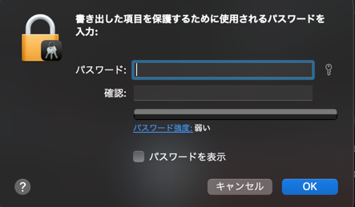

# jpnic_admin

このREADMEでは、dockerを使ったデプロイのやり方を説明します。

## 注意
- **証明書を扱うシステムのため、NAPT配下での利用をおすすめします。**
- **また、ソフトウェアの動作を保証せず、発生した結果について一切の責任を負えません**
## 検証済み
- Ubuntu22.04 + Docker(20.10.17)

## 必要な環境

| -   | 最低     | 推奨     |
|-----|--------|--------|
| CPU | 1Core+ | 2Core+ |
| RAM | 1GB+   | 2GB+   |
- Docker

## ご用意いただくもの
- CA中間証明書
- p12形式の証明書(private鍵とpublic鍵の両方)と複号パスワード
    - ca証明書をp12形式でまとめないように注意

### CA、P12形式の証明書エクスポート方法
#### Mac
1. キーチェーンアクセスのアプリケーションを起動する  

2. 自分の証明書から対象の証明書を選択し、右クリックから「書き出す」を選択する

3. p12形式になっていることを確認し、任意のパスワードを入力する。このパスワードは後ほど必要になります。  

4. CA中間証明書も同様に証明書項目から該当の証明書をcer形式で書き出す。  

## デプロイ方法
1. 本フォルダ内の`docker-compose-example.yml`を`docker-compose.yml`にリネームする。
2. `docker-compose.yml`で必要な部分を書き換える。
3. CA中間証明書をconfigフォルダ内にコピーし、`ca.cert`にリネームする。
4. `docker compose up -d`にて起動し、管理メニュー＞AS/証明書の追加より証明書を登録する。